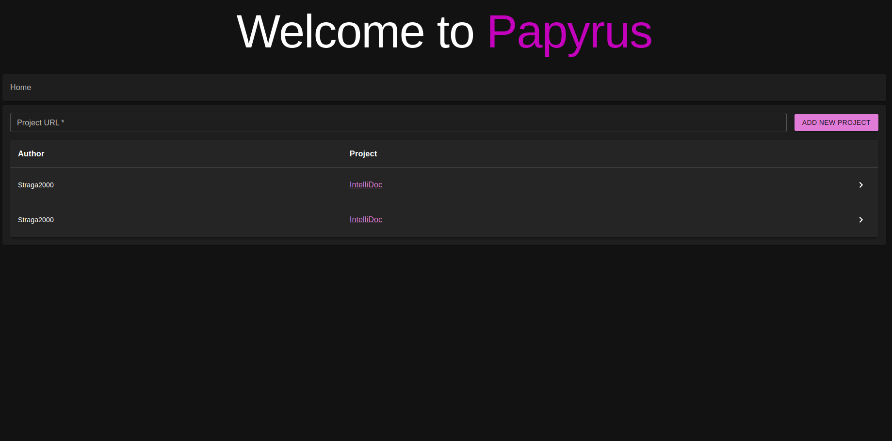
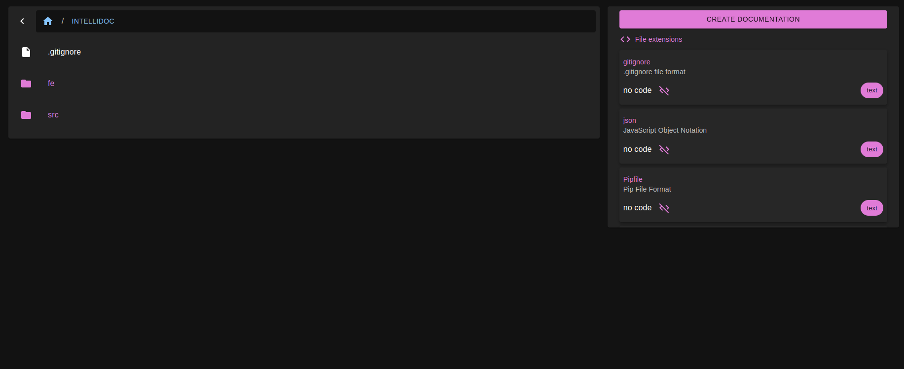
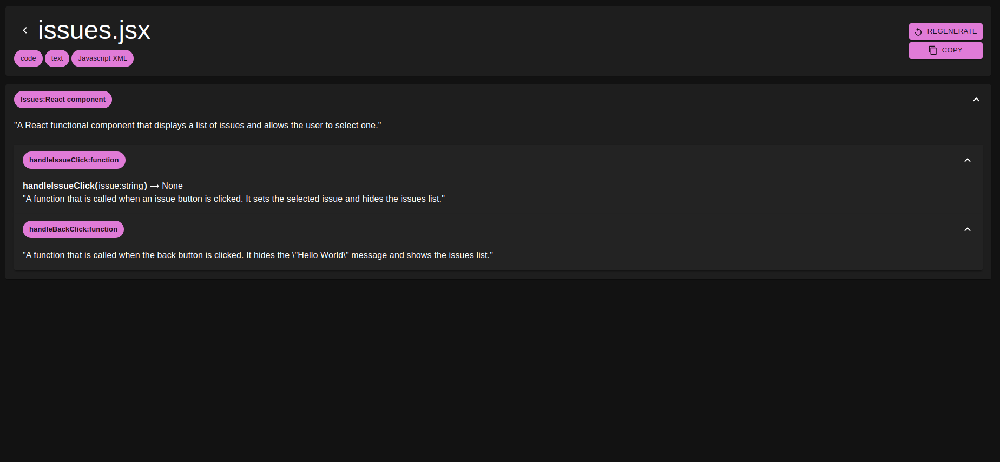

# Papyrus

## 📖 Automated AI Documentation for Your GitHub Projects

Papyrus is an AI-powered tool designed to automate the documentation process for GitHub repositories. Whether you're working on a small project or a large-scale codebase, Papyrus streamlines the creation of high-quality documentation, helping developers save time and focus on what truly matters—writing great code.

## 🚀 Getting Started

### 1️. Setup Environment
Before starting Papyrus, ensure that you have the required environment files for both frontend and backend. Sample `.env` files will be provided.

### 2️. Start Essential Services
Papyrus requires **Redis**, **Chroma Database**, and **Celery workers** to function properly. Use the following commands to start them:
```bash
redis-server
chroma run --host localhost --port 8000 --path ./chroma_data
celery -A config.celery_conn worker --concurrency=2 --loglevel=INFO
```

### 3.️ Start the Servers
Once the essential services are running, launch the **Flask API server** and the **WebSocket server**:
```bash
python run.py  # Starts the backend
python run_ws.py  # Starts the WebSocket server
```

### 4️. Start the Frontend
Navigate to the frontend directory and run:
```bash
npm start  # Starts the React frontend
```

---

## 📌 How to Use Papyrus

Using Papyrus is simple and intuitive:
1. **Provide a GitHub link** to the project you want to document.
2. **Explore the project** using the interactive project explorer.
3. **View suggested documentation files** in a dedicated widget.
4. Click on **"Create Documentation"** to initiate the AI-powered documentation process.
5. Tasks will be queued based on file metadata and executed to generate structured documentation.
6. **Navigate the project tree**, view, copy, or regenerate documentation as needed.

---

## 🖼️ Project Showcase

### 🏠 Homepage


### 📂 Documentation Explorer


### 📝 File Viewer


---

## 🔥 Future Roadmap
Papyrus is constantly evolving! Here are some planned improvements:
- 🎨 **Enhanced User Experience**: Improve UI/UX for better usability.
- ⚙️ **Refactored Documentation Workflow**: Optimize the chaining process used for compiling documentation.
- 🤖 **AI Task Solver**: Introduce an AI-driven feature that can analyze the generated documentation and provide intelligent solutions for development tasks.

Join us in shaping the future of AI-assisted documentation! 🚀
